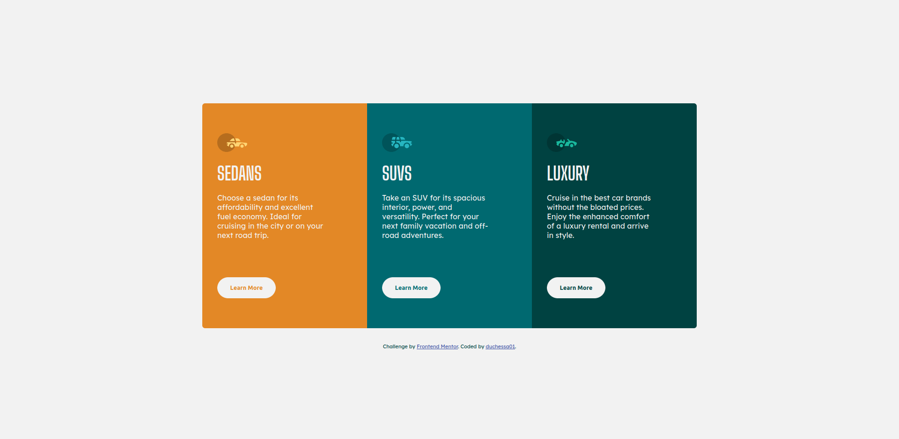

# Frontend Mentor - 3-column preview card component solution

This is a solution to the [3-column preview card component challenge on Frontend Mentor](https://www.frontendmentor.io/challenges/3column-preview-card-component-pH92eAR2-). ## Table of contents

- [Overview](#overview)
  - [Screenshot](#screenshot)
  - [Links](#links)
- [Author](#author)

## Overview

### Screenshot

### Links

- Solution URL: [Code on GitHub](https://github.com/duchessa01/3-column-card)
- Live Site URL: [Live Site](https://duchessa01.github.io/3-column-card)

## Author

- Frontend Mentor - [@duchessa01](https://www.frontendmentor.io/profile/duchessa01)
- GitHub - [@duchessa01](https://www.github.com/duchessa01)
